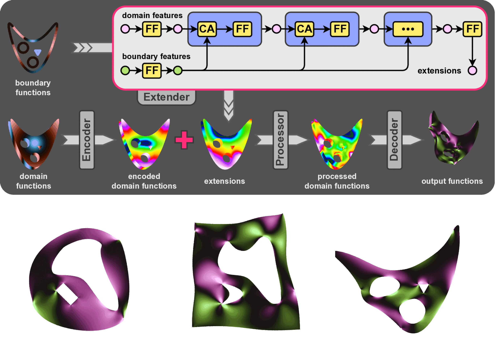
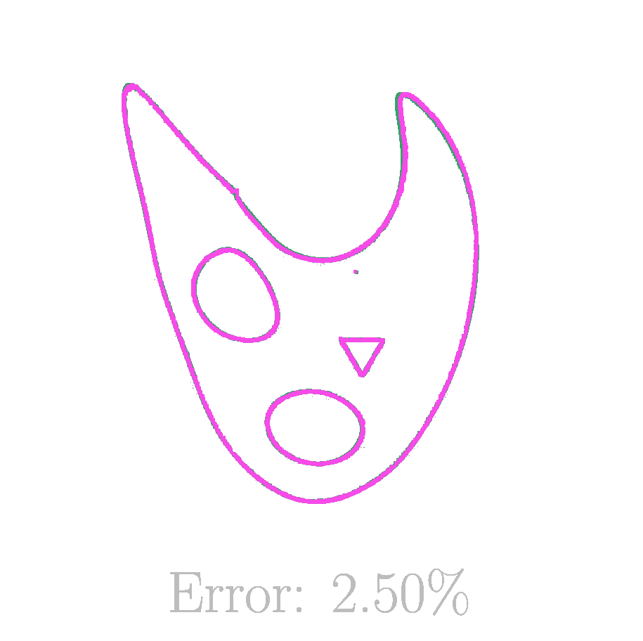
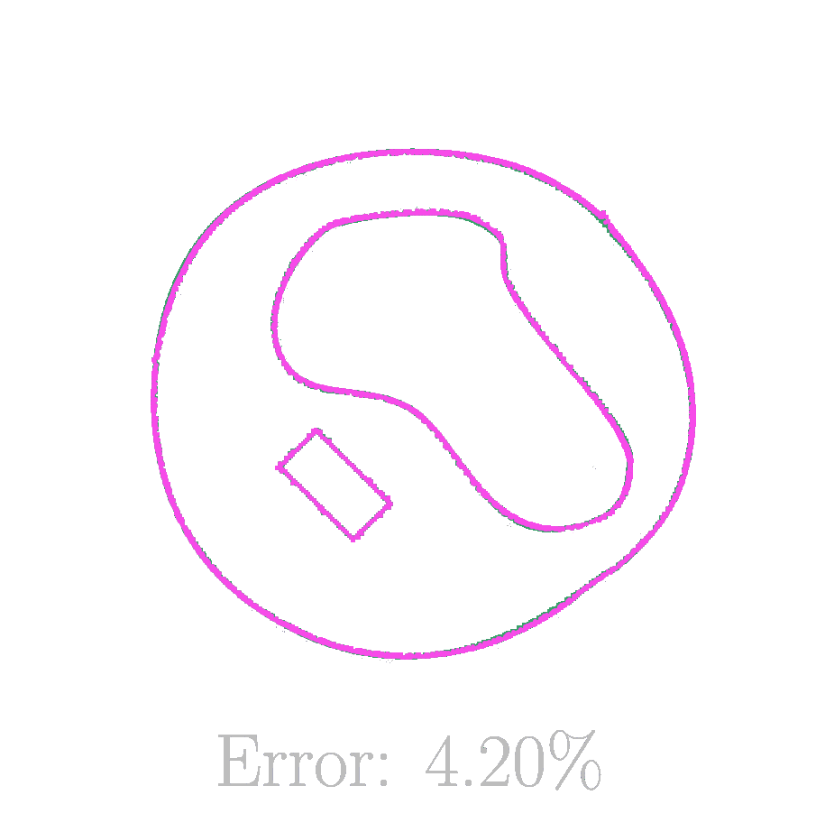
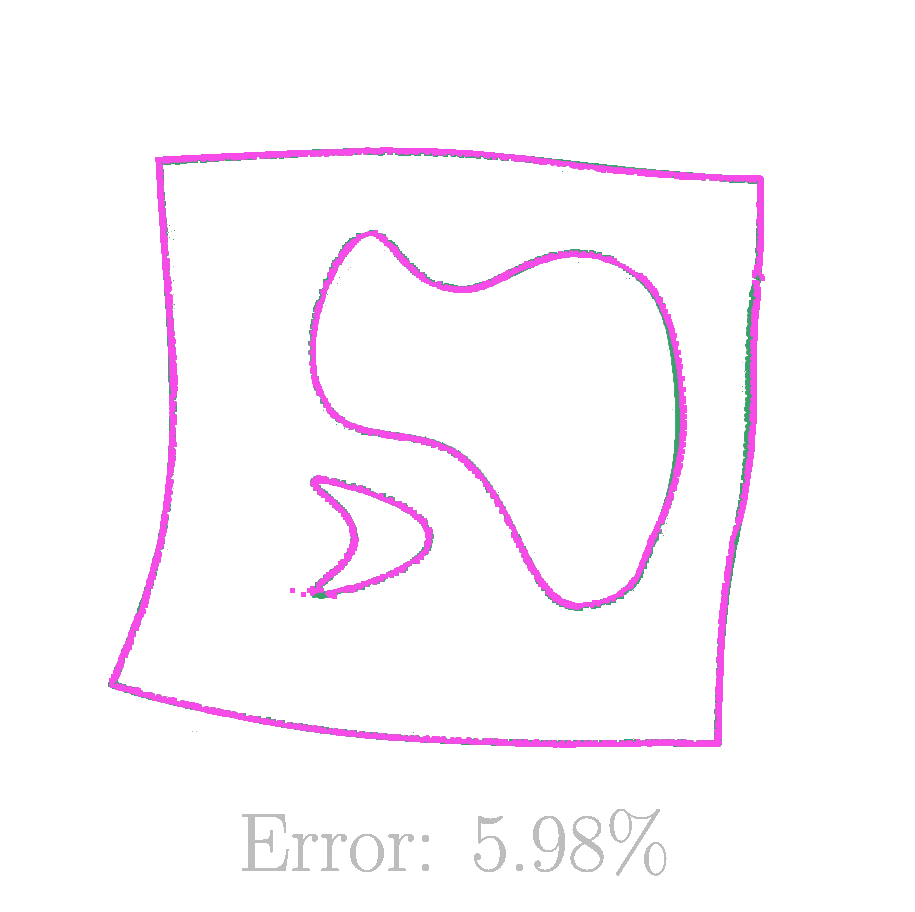

<h3 align="center">
  <a href="https://arxiv.org/abs/2602.04923">  "Imposing Boundary Conditions on Neural Operators via Learned Function Extensions" </a> 
</h3>

<h5 align="center">  Sepehr Mousavi, Siddhartha Mishra, Laura De Lorenzis </h5>

<p align="center">
  
  &#8194;&#8194;&#8194;&#8194;&#8194;&#8194;
  
</p>


<p align="center">
<a href="https://arxiv.org/abs/2602.04923" style="color: inherit; text-decoration: none;">  </a>
&#8194;
<a href="https://doi.org/10.5281/zenodo.18377370" style="color: inherit; text-decoration: none;">  </a>
&#8194;
Neural operators have emerged as powerful surrogates for the solution of partial differential equations (PDEs), yet their ability to handle general, highly variable boundary conditions (BCs) remains limited. Existing approaches often fail when the solution operator exhibits strong sensitivity to boundary forcings. We propose a general framework for conditioning neural operators on complex non-homogeneous BCs through function extensions. Our key idea is to map boundary data to latent pseudo-extensions defined over the entire spatial domain, enabling any standard operator learning architecture to consume boundary information. The resulting operator, coupled with an arbitrary domain-to-domain neural operator, can learn rich dependencies on complex BCs and input domain functions at the same time. To benchmark this setting, we construct 18 challenging datasets spanning Poisson, linear elasticity, and hyperelasticity problems, with highly variable, mixed-type, component-wise, and multi-segment BCs on diverse geometries. Our approach achieves state-of-the-art accuracy, outperforming baselines by large margins, while requiring no hyperparameter tuning across datasets. Overall, our results demonstrate that learning boundary-to-domain extensions is an effective and practical strategy for imposing complex BCs in existing neural operator frameworks, enabling accurate and robust scientific machine learning models for a broader range of PDE-governed problems.

</p>


<hr>

<p align="center">  </p>

<p align="justify">
The architecture consists of an extender module followed by a standard neural operator backbone. The extender uses cross-attention blocks to propagate boundary features from the boundaries into the interior of the domain, producing a latent field that captures the influence of the boundary conditions everywhere. This extended representation is then combined with the usual domain inputs and processed by a neural operator to predict the PDE solution. The main idea is to let the model learn how boundary conditions should be represented in the interior before solving the PDE. Below, you can see some representative model estimates of three test datasets compared against their ground-truth deformation along with the quantitative L2 error of the displacement field.
</p>


<p align="center">
  
  
  
</p>


# Datasets

Follow the instructions in [this Zenodo repository](https://doi.org/10.5281/zenodo.18377370) for downloading the datasets you would like to experiment with, and organize them in a data directory with the following structure:

```
.../
  |__ poisson-circle-bc1/
      |__ train.nc
      |__ test.nc
  |__ poisson-square-bc4/
      |__ train.nc
      |__ test.nc
  |__ elasticity-circlehollow-m1/
      |__ train.nc
      |__ test.nc
  |__ ...
```

Each dataset directory contains a `train.nc` file for training and validation, and a `test.nc` file for testing.

# Code

**Key Components:**

- **`ol.models`**: Neural operator architectures
  - `common.py`: Base classes and utilities
  - `extender.py`: Boundary function extenders and attention mechanisms
  - `rigno.py`: Region Interaction Graph Neural Operator and its extended version
  - `gaot.py`: Geometry Aware Operator Transformer and its extended version

- **`ol.dataset`**: Dataset loading and preprocessing
  - `metadata.py`: Metadata for supported datasets
    > if you plan to experiment with a new dataset, you should add an item to `DATASET_METADATA`. The dataset files must follow the same structure as the other datasets; details in <a href="https://zenodo.org/records/18377370"> our datasets repository </a>.
  - `dataset.py`: HDF5 I/O and normalization

- **`ol.graph`**: Graph construction

- **`ol.metrics`**: Evaluation metrics

- **`ol.stepping`**: Model wrappers including merging and normalization

- **`ol.train`**: Training script supporting extended RIGNO (XRIGNO) and extended GAOT (XGAOT), merging and normalization of mixed-type boundary conditions, zero extensions (zero padding), harmonic extensions (if available in the dataset), and learned extensions

- **`ol.test`**: Testing and evaluation script

## Installation

Clone the repository and navigate inside it:

```bash
git clone https://github.com/sprmsv/olbc.git
cd olbc
```

Create a virtual environment:
```bash
python -m venv .venv
source .venv/bin/activate
```

Install dependencies:

```bash
pip install -r requirements.txt
```
> In order to use JAX with GPUs/TPUs, a proper option should be given to `jax` in `requirements.txt`. Please check [JAX compatibility](https://jax.readthedocs.io/en/latest/installation.html) in order to find the relative option for your hardware. E.g., for NVIDIA GPUs with CUDA 12, `jax[cuda12]` should be installed.


## Training

Train a neural operator on a downloaded dataset with minimal settings:

```bash
python -m ol.train --datadir <path/to/data> --datapath <dataset/name>
```

**Key Arguments:**
- `--datadir`: Path to the folder containing datasets (required)
- `--datapath`: Relative path inside the data directory (required), e.g., `poisson-circle-bc1`
- `--exp`: Experiment name for organizing results (default: '000')
- `--epochs`: Number of training epochs (default: 20)
- `--n_train`: Number of training samples (default: 16)
- `--n_valid`: Number of validation samples (default: 16)
- `--core_name`: Operator architecture - `XRIGNO` or `XGAOT` (default: `XRIGNO`)
- `--batch_size`: Batch size per device (default: 2)

View all available arguments:

```bash
python -m ol.train --help
```

During training, checkpoints and metrics are saved to the path `./ol/experiments/E<exp>/<datapath>/<timestamp>/`.

## Testing

Evaluate a trained model on test data:

```bash
python -m ol.test --exp <path/to/experiment> --datadir <path/to/data> --datapath <dataset/name>
```

**Key Arguments:**
- `--exp`: Relative path of the experiment (required)
- `--datadir`: Path to the folder containing datasets (required)
- `--datapath`: Relative path inside the data directory (required)
- `--batch_size_per_device`: Batch size for inference (default: 16)

Results (metrics, errors, plots) are saved to `<experiment>/tests/`.

## Citation

<p style="color:red"> </p>

```bibtex
@inproceedings{mousavi2026imposing,
  title     = {Imposing Boundary Conditions on Neural Operators via Learned Function Extensions},
  author    = {Sepehr Mousavi and Siddhartha Mishra and Laura De Lorenzis},
  booktitle = {International Conference on Machine Learning},
  volume    = {43},
  year      = {2026},
}
```
